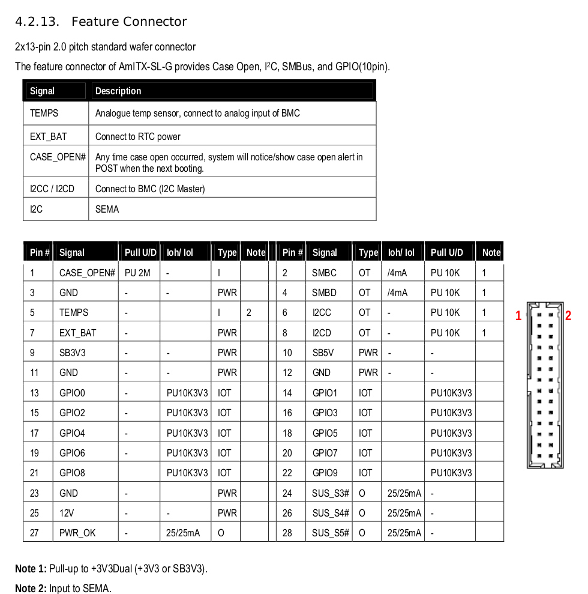
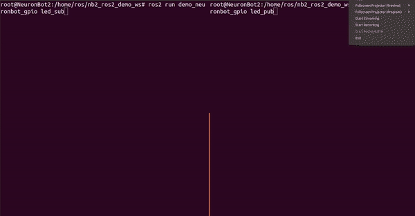
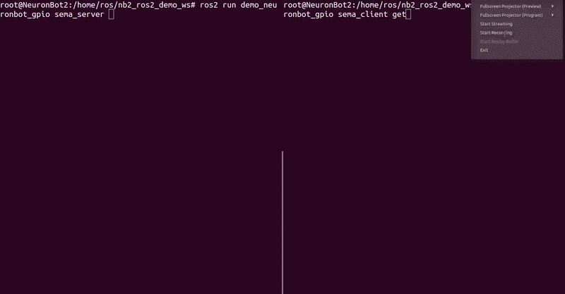

# NeuronBot GPIO Demo
This package performs two examples, "LED Blink" and "Push the Button" of GPIO on NeuronBot. In LED Blink, there is a publisher publishes the command to control the LED. Also, there is a subscriber subscribes the data to turn on or turn off the LED by setting the voltage of the pin. On the other hand, in Push the Button, there is a service named "sema_gpio". To get the status of the button, run the sema_client to call the service and run the sema_server to provide the data.


The GPIO pin layout of the ROS Starter Kit was set as followed:



In this two examples, we use SEMA library to control the GPIO of ROS Starter Kit. Please refer to [ADLINK SEMA](https://www.adlinktech.com/Products/Industrial_IoT_and_Cloud_solutions/SEMA_Smart_Embedded_Management_Agent/SEMA?lang=en) for fully installation and setup of SEMA. Futhermore, for GPIO pin layout of ROS Starter Kit, please review the user maual of [ADLINK Embedded Boards](https://www.adlinktech.com/Products/Industrial_Motherboards_SBCs/Mini-ITXEmbeddedBoards/AmITX-SL-G?lang=en). 


Now, we support the following verion, you can checkout to these branch.
- ROS 1 melodic
- ROS 2 dashing


## ROS2
### Example 1 : LED Blink
GPIO ID: 7

* Terminal 1
1. Open a root session
    ```
    sudo su
    ```
2. Source the enviornment
    ```
    cd /home/USER/neuronbot_demo_ros2_ws/
    source /opt/ros/dashing/setup.bash
    export LD_LIBRARY_PATH=/usr/local/SEMA/lib/:$LD_LIBRARY_PATH
    source install/local_setup.bash
    ```
3. Run the subscriber to subsrcibe data from the topic, led_blink.
    ```
    ros2 run demo_neuronbot_gpio led_sub
    ```

* Terminal 2
1. Open a root session
    ```
    sudo su
    ```
2. Source the enviornment
    ```
    cd /home/USER/neuronbot_demo_ros2_ws/
    source /opt/ros/dashing/setup.bash
    export LD_LIBRARY_PATH=/usr/local/SEMA/lib/:$LD_LIBRARY_PATH
    source install/local_setup.bash
    ```
3. Publish random number of 0 and 1 to the topic, led_blink. 
    ```
    ros2 run demo_neuronbot_gpio led_pub
    ```


### Example 2 : Push the button
GPIO ID: 9

* Terminal 1
1. Open a root session
    ```
    sudo su
    ```
2. Source the enviornment
    ```
    cd /home/USER/neuronbot_demo_ros2_ws/
    source /opt/ros/dashing/setup.bash
    export LD_LIBRARY_PATH=/usr/local/SEMA/lib/:$LD_LIBRARY_PATH
    source install/local_setup.bash
    ```
3. Run the client to call the service, sema_gpio.
    ```
    ros2 run demo_neuronbot_gpio sema_client get
    ```

* Terminal 2
1. Open a root session
    ```
    sudo su
    ```
2. Source the enviornment
    ```
    cd /home/USER/neuronbot_demo_ros2_ws/
    source /opt/ros/dashing/setup.bash
    export LD_LIBRARY_PATH=/usr/local/SEMA/lib/:$LD_LIBRARY_PATH
    source install/local_setup.bash
    ```
3. Run the server to provide data called by client.
    ```
    ros2 run demo_neuronbot_gpio sema_server
    ```



