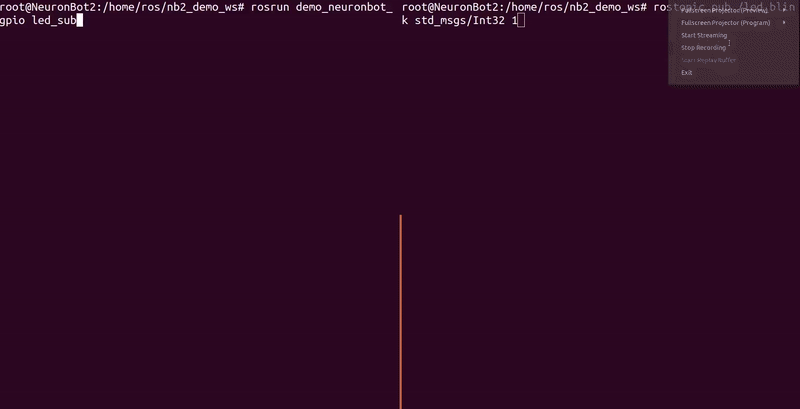

# NeuronBot GPIO Demo
This package performs two examples, "LED Blink" and "Push the Button" of GPIO on NeuronBot. In LED Blink, there is a publisher publishes the command to control the LED. Also, there is a subscriber subscribes the data to turn on or turn off the LED by setting the voltage of the pin. In Push the Button, there is a publisher publishes the voltage of pin of the button. When subscriber subscribing the data, it will show that whether the user is pushing the button or not.


The GPIO pin layout of the ROS Starter Kit was set as follow:


In this two examples, we use SEMA library to control the GPIO of ROS Starter Kit. Please refer to [ADLINK SEMA](https://www.adlinktech.com/Products/Industrial_IoT_and_Cloud_solutions/SEMA_Smart_Embedded_Management_Agent/SEMA?lang=en) for fully installation and setup of SEMA. Futhermore, for detailed GPIO pin layout of ROS Starter Kit, please review the user maual of [ADLINK Embedded Boards](https://www.adlinktech.com/Products/Industrial_Motherboards_SBCs/Mini-ITXEmbeddedBoards/AmITX-SL-G?lang=en). 


Now, we support the following verion, you can checkout to these branch.
- ROS 1 melodic
- ROS 2 dashing


## ROS1
### Example 1 : LED Blink
GPIO ID: 7

* Terminal 1
1. Source the environment
    ```
    source /opt/ros/melodic/setup.bash
    ```
2. Launch the roscore
    ```
    roscore
    ```

* Terminal 2
1. Open a root session
    ```
    sudo su
    ```
2. Source the enviornment
    ```
    cd /home/USER/neuronbot_demo_ros1_ws/
    source /opt/ros/melodic/setup.bash
    export LD_LIBRARY_PATH=/usr/local/SEMA/lib/:$LD_LIBRARY_PATH
    source devel/setup.bash
    ```
3. Run the subscriber to subsrcibe data from the topic, led_blink.
    ```
    rosrun demo_neuronbot_gpio led_sub
    ```

* Terminal 3
1. Source the enviornment
    ```
    cd ~/neuronbot_demo_ros1_ws/
    source /opt/ros/melodic/setup.bash
    source devel/setup.bash
    ```
2. Publish data to the topic, led_blink, to turn on the LED.
    ```
    rostopic pub /led_blink std_msgs/Int32 1
    ```
3. Publish data to the topic, led_blink, to turn off the LED.
    ```
    rostopic pub /led_blink std_msgs/Int32 0
    ```


### Example 2 :  Push the button
GPIO ID: 9

* Terminal 1
1. Source the environment
    ```
    cd ~/neuronbot_demo_ros1_ws/
    source /opt/ros/melodic/setup.bash
    source devel/setup.bash
    ```
2. Launch the roscore
    ```
    roscore
    ```

* Terminal 2
1. Open a root session
    ```
    sudo su
    ```
2. Source the enviornment
    ```
    cd /home/USER/neuronbot_demo_ros1_ws/
    source /opt/ros/melodic/setup.bash
    export LD_LIBRARY_PATH=/usr/local/SEMA/lib/:$LD_LIBRARY_PATH
    source devel/setup.bash
    ```
3. Run the subscriber to subsrcibe data from the topic, button_push.
    ```
    rosrun demo_neuronbot_gpio button_pub
    ```

* Terminal 3
1. Open a root session
    ```
    sudo su
    ```
2. Source the enviornment
    ```
    cd /home/USER/neuronbot_demo_ros1_ws/
    source /opt/ros/melodic/setup.bash
    export LD_LIBRARY_PATH=/usr/local/SEMA/lib/:$LD_LIBRARY_PATH
    source devel/setup.bash
    ```
3. Run the subscriber to subsrcibe data from the topic, button_push.
    ```
    rosrun demo_neuronbot_gpio button_sub
    ```


